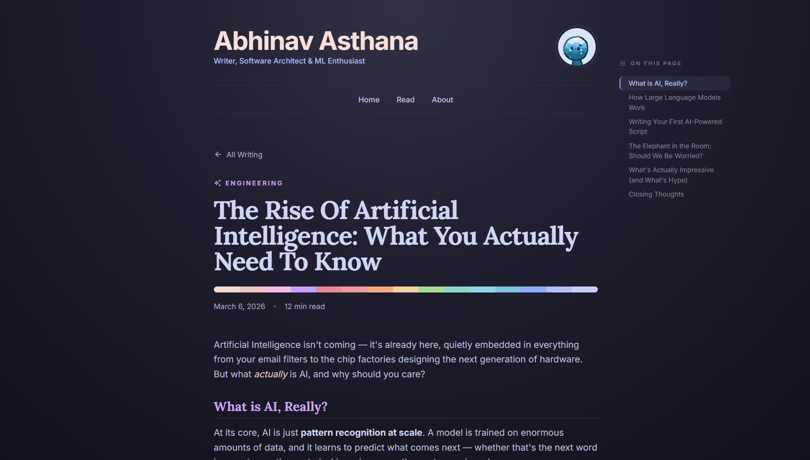

<h1>📝 Blog</h1>

<p>


</p>

<br/>

<br/>

<p align="center">
  <i><b>A minimal, opinionated personal blog built with Django.</b></i>
</p>

## ✨ Features

- Markdown authoring with **django-markdownx**, **pymdownx.superfences**, and custom callouts
- Syntax highlighting powered by **Highlight.js** (client-side, Catppuccin-themed)
- Hypermedia-driven UI with htmx — paginated post list with no full-page reloads
- **SEO-ready** — per-page Open Graph tags, canonical URLs, article metadata
- Featured posts — pin any post to the homepage hero section
- **WhiteNoise** for compressed, cache-busted static file serving
- _Catppuccin Macchiato_ aesthetic throughout

## 🚀 Getting Started

1. **Prerequisites**

- Python >= 3.12
- `uv` (recommended) or `pip`

2. **Installation**

```bash
# Clone the repository
git clone https://github.com/abhicodes07/blog.git
cd blog

# Install dependencies
uv sync

# Set up environment variables
# Create/Edit .env with your values

# Run migrations
uv run python manage.py migrate

# Start the development server
uv run python manage.py runserver
```

## 📂 Project Structure

```text
blog/
├── blog/                   # Core app
│   ├── models.py           # Post model
│   ├── views.py            # home, post_list, post_detail
│   ├── urls.py
│   ├── obsidian_callout.py # Custom  > [!TYPE] preprocessor
│   └── templates/
│       └── blog/
├── core/
│   ├── settings.py
│   ├── urls.py
│   └── wsgi.py
├── templates/
│   └── layout.html         # Base layout with SEO meta tags
├── static/                 # CSS, JS, assets
├── pyproject.toml
└── manage.py
```

## ⚙️ Configuration

- Create a `.env` file in the project root:

```env
SECRET_KEY=your-secret-key-here
DEBUG=True
ALLOWED_HOSTS=localhost,127.0.0.1
SESSION_COOKIE_SECURE=False
CSRF_COOKIE_SECURE=False
SECURE_HSTS_SECONDS=0
```

> For production, set `DEBUG=False`, use a strong `SECRET_KEY`, and configure proper `ALLOWED_HOSTS`.

## ✏️ Writing Posts

- Posts are authored in Markdown via the Django admin at `/admin/`.

**Supported Markdown features**

- GitHub Flavored Markdown (tables, strikethrough, etc.)
- Fenced code blocks with syntax highlighting
- Admonitions (`!!! note`, `!!! warning`, etc.)
- Obsidian-style callouts — `> [!NOTE]`, `> [!TIP]`, `> [!WARNING]`
- Nested fences via `pymdownx.superfences`

---

<div align="center">
<a href="https://github.com/abhicodes07/personal-blog-site/blob/main/LICENSE">

</a>
</div>
